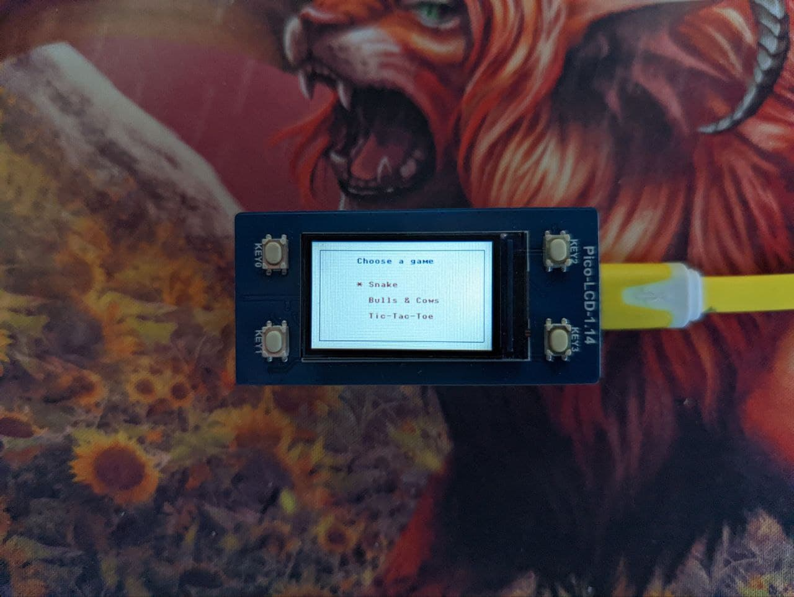

# pi_pico_game_console

Requirements
- Raspberry Pi Pico 
- Waveshare Raspberry Pi Pico display 1.14" (version 1 with 4 buttons): https://amperka.ru/product/waveshare-raspberry-pi-pico-display-lcd-1n14in-spi or https://aliexpress.ru/item/1005002279383058.html

in Menu:
- use KEY1 to move in menu
- use KEY3 to enter in game menu

in Snake
- KEY1 for move right
- KEY3 for move left

in Bulls & Cows
- KEY1 for moving position in number
- KEY0 for increase number in position
- KEY3 for checking bulls and cows

in Tic-Tac-Toe
- KEY3 move cursor in field
- KEY1 set X or O

in All games
- KEY2 exit
- KEY0 start game

